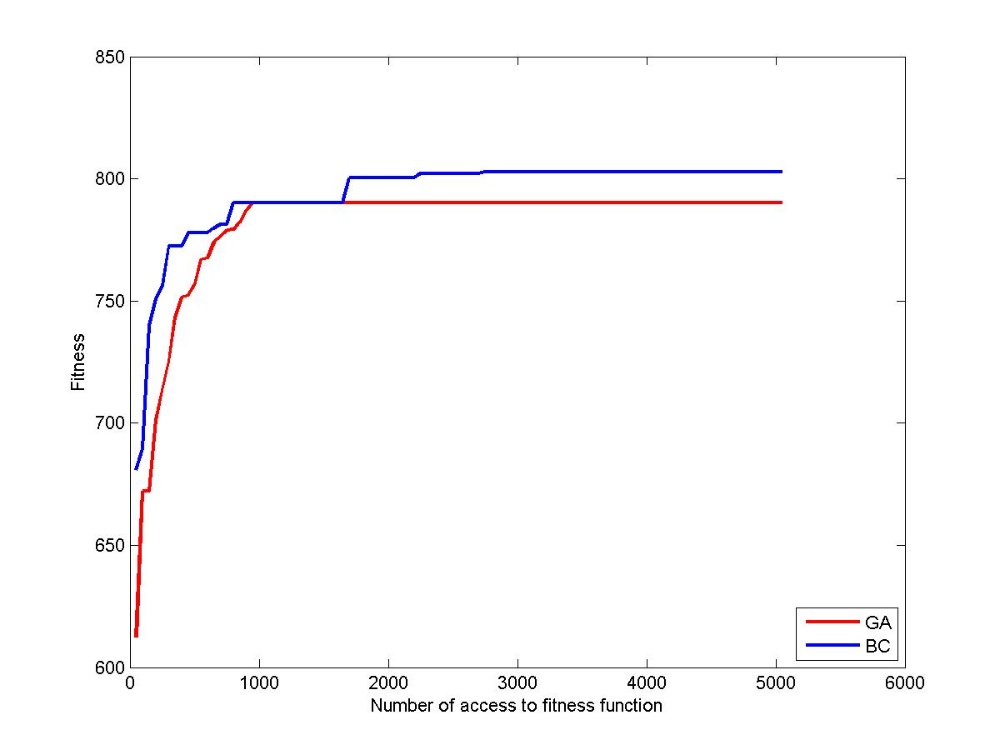

# Clustering in Mobile Wireless Sensor Networks Based on Intelligent Methods

This repository contains my Master's thesis, "Clustering in Mobile Wireless Sensor Networks Based on Intelligent Methods", completed at Tabriz University, under the field of Computer Engineering with a focus on Software. My thesis delves into the challenges and solutions related to energy efficiency in Mobile Wireless Sensor Networks (MWSNs) through the use of evolutionary algorithms.

## Project Overview

The thesis explores the concept of clustering in MWSNs, emphasizing the importance of energy efficiency in these networks. MWSNs face unique challenges due to their mobile nature, including dynamic topology, variable node positioning, and energy constraints. Efficient clustering and cluster-head selection are crucial for optimizing power usage and maintaining network functionality in applications like search and rescue operations, health monitoring, and intelligent traffic control systems.

### Key Concepts and Algorithms:

- **Clustering and Energy Efficiency**: Investigates the role of dynamic clustering in managing energy consumption in MWSNs.
- **Evolutionary Algorithms**: Focuses on the use of genetic algorithms and bacterial composition for intelligent cluster-head selection.
- **Genetic Algorithms (GA)**: Implements GA to enhance the process of selecting cluster-heads, thereby improving energy efficiency and network longevity.
- **Bacterial Conjugation (BC)**: Applies the BC algorithm for efficient cluster-head selection, showcasing an increase in clustering speed and cluster lifetime.

### Implementation:

- **LEACH-M Algorithm**: Initial implementation using the LEACH-M (Low Energy Adaptive Clustering Hierarchy for mobile sensors) algorithm in MATLAB, providing a baseline for comparison.
- **Enhancements with GA and BC**: Subsequent implementations involve the integration of GA and BC for smarter and more efficient cluster-head selection.

### Results:

The simulation results indicate that the application of the BC algorithm leads to a 14% improvement in clustering speed and an increase in the lifetime of clusters compared to traditional methods.

## Repository Structure

- `MatlabCode/`: Contains the MATLAB code used for simulations and algorithm implementations.
- `Thesis.pdf`: The complete thesis document detailing the research, methodology, and findings.
- `Data/`: Includes the data sets and results obtained from the simulations.

## Keywords

- Clustering, Energy Efficiency, Mobile Wireless Sensor Networks, Evolutionary Algorithms, Genetic Algorithms, Bacterial Conjugation

---

